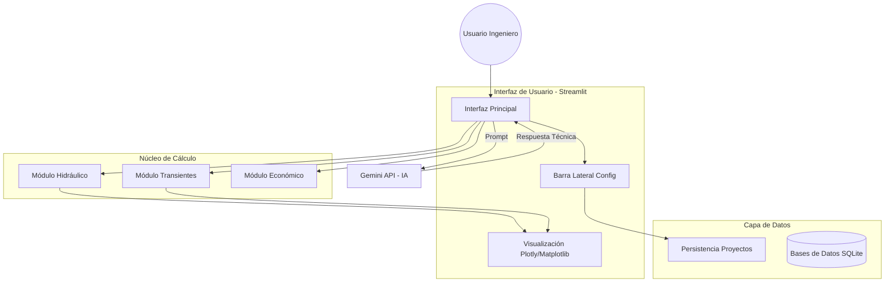

# CAPÍTULO II: METODOLOGÍA Y DESARROLLO DEL SOFTWARE

## 2.1 Enfoque Metodológico

El desarrollo de este proyecto de investigación aplicada sigue una metodología híbrida que combina la ingeniería de software moderna con los principios del diseño de ingeniería civil. Se ha adoptado un enfoque de **Desarrollo Ágil (Scrum adaptado)**, permitiendo iteraciones rápidas entre la implementación de algoritmos hidráulicos y su validación técnica.

El proceso se dividió en cuatro fases principales:
1.  **Definición de Requerimientos:** Identificación de las variables críticas en el diseño de estaciones de bombeo según normativa (INEN, SENAGUA).
2.  **Modelado Matemático Computacional:** Traducción de las ecuaciones diferenciales y algebraicas (vistas en el Cap. I) a algoritmos secuenciales en Python.
3.  **Diseño de Arquitectura de Software:** Estructuración modular para garantizar escalabilidad y mantenimiento.
4.  **Validación y Calibración:** Comparación continua con software comercial (EPANET) y cálculos manuales.

## 2.2 Arquitectura del Sistema

La aplicación "App_Bombeo" se construyó utilizando **Python 3.10+** como lenguaje núcleo debido a su robustez en cálculo científico (librerías *NumPy, Pandas, SciPy*). La arquitectura sigue un patrón modular que separa la lógica de cálculo (Backend) de la interfaz de usuario (Frontend).

### 2.2.1 Diagrama de Componentes

La estructura general del sistema se ilustra en el siguiente diagrama, donde se evidencian las interacciones entre los módulos de interfaz, el núcleo de cálculo y los servicios externos (API IA).


*Figura 2.1: Arquitectura de alto nivel de la aplicación.*

### 2.2.2 Descripción de Tecnologías

*   **Streamlit:** Framework utilizado para el desarrollo rápido de la interfaz web, permitiendo convertir scripts de datos en aplicaciones interactivas.
*   **NumPy & Pandas:** Utilizados para la vectorización de cálculos hidráulicos, permitiendo procesar miles de puntos de operación (curvas VFD) en milisegundos.
*   **Matplotlib & Plotly:** Librerías gráficas para la generación de curvas características estáticas y dinámicas e interactivas.
*   **Google Gemini API:** Modelo de lenguaje integrado para asistir en la interpretación de resultados y consulta de normativa.

## 2.3 Lógica de Cálculo Computacional

El "corazón" del software reside en sus algoritmos de cálculo, diseñados para resolver problemas no lineales típicos de la hidráulica.

### 2.3.1 Algoritmo de Selección de Diámetros

El software no se limita a calcular pérdidas para un diámetro dado, sino que realiza una búsqueda heurística:

1.  **Generación de Candidatos:** Se crea una lista de diámetros comerciales disponibles en la base de datos interna.
2.  **Filtrado por Velocidad:** Se descartan aquellos diámetros que producen velocidades fuera del rango normativo ($0.6 m/s < V < 2.5 m/s$).
3.  **Evaluación Económica:** Para los candidatos restantes, se calcula el Costo Anual Equivalente (CAE) sumando la amortización de la tubería y el costo de energía anual.
4.  **Selección:** Se propone al usuario el diámetro con menor CAE como "Óptimo Económico".

**Pseudocódigo Simplificado:**
```python
def seleccionar_diametro_optimo(Q, L, Tuberias):
    candidatos = []
    for tuberia in Tuberias:
        Area = duplicar_pi * (tuberia.D_int / 2)**2
        V = Q / Area
        if 0.6 <= V <= 2.5: # Criterio Normativo
            Hf = calcular_darcy(Q, L, tuberia.D_int)
            Potencia = gamma * Q * (Hg + Hf) / eficiencia
            Costo_Total = costo_inversion(tuberia) + vpn_energia(Potencia)
            candidatos.append((tuberia, Costo_Total))
    
    return min(candidatos, key=lambda x: x[1])
```

### 2.3.2 Simulación de Transientes (Golpe de Ariete)

Para el análisis de flujo no permanente, se implementó el **Método de las Características (MOC)**. Este método transforma las ecuaciones diferenciales parciales (conservación de masa y momentum) en ecuaciones diferenciales ordinarias válidas a lo largo de líneas características ($dx/dt = \pm a$) en el plano $x-t$.

El dominio de la tubería se discretiza en $N$ tramos de longitud $\Delta x = L/N$. El paso de tiempo se fija bajo la condición de estabilidad de Courant: $\Delta t = \Delta x / a$.

El flujo de trabajo del algoritmo es:
1.  **Estado Estacionario ($t=0$):** Se calculan $H_0$ (cargas) y $Q_0$ (caudales) en todos los nodos considerando operación normal.
2.  **Condiciones de Frontera:**
    *   *Aguas Arriba (Embalse/Bomba):* $H = Constante$ o $H = f(Q)$ (curva de la bomba). En caso de paro, la velocidad de la bomba decae según su inercia rotacional ($I$).
    *   *Aguas Abajo (Tanque/Válvula):* $H = Constante$ o $Q = f(H)$ (ecuación de descarga del orificio).
3.  **Proceso Iterativo:** Para cada paso de tiempo $\Delta t$, se calculan las cargas y caudales en los nodos interiores usando las ecuaciones características positiva ($C^+$) y negativa ($C^-$).

## 2.4 Integración de Inteligencia Artificial

Una innovación clave de esta tesis es la integración de un asistente basado en LLM (Large Language Model).

### 2.4.1 Ingeniería de Prompts (Prompt Engineering)

Para evitar "alucinaciones" (datos inventados), se diseñó un "System Prompt" robusto que define el rol del asistente:

> *"Eres un experto en ingeniería hidráulica sanitaria. Tu función es analizar los datos proporcionados por el software (Caudal, Altura, Eficiencia) y emitir recomendaciones técnicas basadas en normas INEN/SENAGUA. No inventes valores. Si el NPSH disponible es menor al requerido, alerta sobre cavitación inmediata."*

La comunicación sigue el flujo:
1.  El usuario solicita un análisis (ej. "¿Es adecuada esta bomba?").
2.  El backend recopila el contexto JSON con los resultados numéricos actuales.
3.  Se envía el prompt enriquecido (Contexto + Pregunta) a la API de Gemini.
4.  La respuesta se renderiza en la interfaz.

## 2.5 Persistencia y Gestión de Datos

Para garantizar que el ingeniero pueda guardar y retomar sus diseños, se implementó un sistema de serialización en formato **JSON**.

### 2.5.1 Estructura del Archivo de Proyecto
Cada proyecto se guarda como un objeto estructurado que contiene:
*   `metadata`: Fecha, autor, ID del proyecto.
*   `input_data`: Parámetros de diseño (Caudal, cotas, temperaturas).
*   `selected_equipment`: ID de la bomba seleccionada, diámetro de tubería elegido.
*   `simulation_results`: Resumen de la última simulación válida (Pmax, Pmin).

Esta estructura permite no solo la portabilidad (enviar el archivo por correo), sino también la interoperabilidad futura con otros sistemas BIM/GIS.

---
**Fin del Capítulo II**
