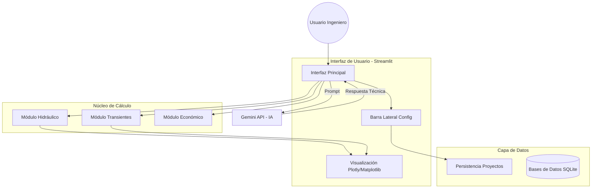

# TESIS DE MAESTRÍA EN INGENIERÍA HIDROSANITARIA

## DISEÑO Y VALIDACIÓN DE SOFTWARE PARA SISTEMAS DE BOMBEO ASISTIDO POR IA

---

# CAPÍTULO I: MARCO TEÓRICO Y FUNDAMENTOS DE SISTEMAS DE BOMBEO

## 1.1 Introducción a la Hidráulica de Sistemas a Presión

El diseño de sistemas de abastecimiento de agua potable mediante bombeo requiere una comprensión profunda de los principios fundamentales de la mecánica de fluidos incompresibles. A diferencia de los modelos simplificados, la ingeniería de detalle debe considerar no solo el estado estacionario, sino también los fenómenos transitorios y la interacción no lineal entre los componentes del sistema.

### 1.1.1 Ecuación de la Energía y Línea de Gradiente Hidráulico

El principio de conservación de la energía en un flujo permanente e incompresible se expresa mediante la ecuación de Bernoulli generalizada, que relaciona la energía de posición, presión y velocidad entre dos secciones de control. Para un volumen de control entre un punto de succión (S) y un punto de descarga (D), la ecuación se formula como:

$$ \frac{P_S}{\gamma} + z_S + \frac{V_S^2}{2g} + H_B = \frac{P_D}{\gamma} + z_D + \frac{V_D^2}{2g} + \sum h_{f_{S-D}} + \sum h_{loc_{S-D}} $$

**Donde:**
*   $P/\gamma$: Carga de presión o altura piezométrica $[m]$.
*   $z$: Carga de posición o altura geodésica respecto a un plano de referencia (DATUM) $[m]$.
*   $V^2/2g$: Carga de velocidad o altura cinética $[m]$.
*   $H_B$: Altura Dinámica Total (ADT) añadida por el equipo de bombeo al fluido $[m]$.
*   $\sum h_f$: Sumatoria de pérdidas de carga por fricción a lo largo de la conducción $[m]$.
*   $\sum h_{loc}$: Sumatoria de pérdidas locales o menores debidas a accesorios $[m]$.
*   $\gamma$: Peso específico del agua ($9810 N/m^3$ a 20°C).
*   $g$: Aceleración de la gravedad ($9.81 m/s^2$).

La **Línea de Gradiente Hidráulico (LGH)** representa la suma de las energías potencial y de presión ($\frac{P}{\gamma} + z$) a lo largo de la tubería. Es imperativo que, en condiciones normales de operación, la LGH se mantenga por encima del perfil de la tubería para evitar presiones negativas que podrían inducir cavitación o intrusión de contaminantes.

### 1.1.2 Modelos Matemáticos para Pérdidas por Fricción

La correcta estimación de las pérdidas por fricción es crítica para determinar la potencia requerida. Aunque existen diversas formulaciones empíricas, este proyecto prioriza el uso de la ecuación de **Darcy-Weisbach** debido a su fundamentación física y aplicabilidad general, complementada por la ecuación de Hazen-Williams para validaciones rápidas en tuberías de agua.

#### A. Ecuación de Darcy-Weisbach
Es la formulación teóricamente más exacta para flujos a presión:

$$ h_f = f \cdot \frac{L}{D_{int}} \cdot \frac{V^2}{2g} $$

**Donde:**
*   $h_f$: Pérdida de carga por fricción $[m]$.
*   $f$: Factor de fricción de Darcy (adimensional), función del Número de Reynolds ($Re$) y la rugosidad relativa ($\epsilon/D$).
*   $L$: Longitud de la tubería $[m]$.
*   $D_{int}$: Diámetro interno real de la conducción $[m]$.
*   $V$: Velocidad media del flujo $[m/s]$.

Para la determinación del factor de fricción $f$ en régimen turbulento ($Re > 4000$), se utiliza la ecuación implícita de **Colebrook-White**:

$$ \frac{1}{\sqrt{f}} = -2 \log_{10} \left( \frac{\epsilon/D}{3.7} + \frac{2.51}{Re\sqrt{f}} \right) $$

**Donde:**
*   $\epsilon$: Rugosidad absoluta de la pared interna del tubo $[m]$ (ej. $1.5 \times 10^{-6} m$ para PVC).
*   $Re$: Número de Reynolds, $Re = \frac{V \cdot D}{\nu}$.
*   $\nu$: Viscosidad cinemática del agua ($1.004 \times 10^{-6} m^2/s$ a 20°C).

Dado que Colebrook-White requiere solución iterativa, en el desarrollo computacional de este proyecto se implementan aproximaciones explícitas de alta precisión como la de **Swamee-Jain (1976)** para optimizar el tiempo de cálculo sin sacrificar exactitud ingenieril.

#### B. Ecuación de Hazen-Williams
Ampliamente utilizada en la ingeniería sanitaria norteamericana para agua a temperatura ambiente:

$$ h_f = \frac{10.67 \cdot L \cdot Q^{1.852}}{C^{1.852} \cdot D^{4.87}} $$

**Donde:**
*   $Q$: Caudal $[m^3/s]$.
*   $C$: Coeficiente de rugosidad de Hazen-Williams (ej. 150 para PVC, 140 para PEAD).

El software desarrollado permite al usuario seleccionar entre ambos métodos, recomendando Darcy-Weisbach para cálculos de golpe de ariete y sistemas de alta presión.

## 1.2 Teoría de Bombas Centrifugas

Las bombas centrífugas son turbomáquinas que transforman energía mecánica en energía hidráulica mediante la acción de la fuerza centrífuga. Su comportamiento no es constante, sino que depende de las condiciones del sistema hidráulico al que están acopladas.

### 1.2.1 Curvas Características

La operación de una bomba se describe mediante sus curvas características, las cuales relacionan el caudal ($Q$) con otras variables fundamentales. Estas curvas son provistas por el fabricante mediante pruebas de banco.

1.  **Curva Caudal vs. Altura (Q-H):** Describe la energía por unidad de peso que la bomba entrega al fluido para un caudal dado. Tiene una pendiente negativa; a mayor caudal, menor altura dinámica entregada. Se modela matemáticamente como un polinomio de segundo orden:
    $$ H_{bomba} = A - B \cdot Q^2 $$
    Donde $A$ representa la altura a válvula cerrada (Shut-off head).

2.  **Curva de Eficiencia ($\eta$):** Muestra el rendimiento de la conversión de energía. Presenta un máximo en el Punto de Mejor Eficiencia (BEP).
    $$ \eta = \frac{P_{hid}}{P_{freno}} = \frac{\gamma \cdot Q \cdot H}{76 \cdot HP_{motor}} $$

3.  **Curva de Potencia (P):** Indica la potencia al freno (BHP) requerida en el eje de la bomba.

### 1.2.2 Punto de Operación del Sistema

El punto de operación se obtiene mediante la intersección de la **Curva del Sistema** y la **Curva de la Bomba**. La curva del sistema representa la energía necesaria para transportar un caudal $Q$ desde la succión hasta la descarga y viene dada por:

$$ H_{sistema} = H_{estática} + K \cdot Q^2 $$

**Donde:**
*   $H_{estática}$: Desnivel geométrico total ($z_D - z_S$) más la diferencia de presión residual requerida.
*   $K$: Coeficiente de resistencia global, que agrupa todas las pérdidas por fricción y locales ($K = \sum R_{fricción} + \sum R_{locales}$).

**[INSERTAR GRÁFICO: Fig_1_1_Punto_Operacion.png]**
*Figura 1.1: Representación gráfica del Punto de Operación como la intersección entre la curva motriz de la bomba y la curva resistente del sistema. Se observa también la variación de la eficiencia.*

El software desarrollado calcula iterativamente este punto para asegurar que la bomba seleccionada opere cerca de su BEP, garantizando la eficiencia energética y la longevidad del equipo.

## 1.3 Fenómeno de Cavitación y NPSH

La cavitación es uno de los problemas más destructivos en sistemas de bombeo. Ocurre cuando la presión absoluta del líquido en cualquier punto de la bomba (generalmente en el ojo del impulsor) desciende por debajo de su presión de vapor ($P_v$), provocando la formación de burbujas de vapor que colapsan violentamente al entrar en zonas de mayor presión.

### 1.3.1 NPSH Disponible (NPSHa) vs. NPSH Requerido (NPSHr)

Para evitar la cavitación, es condición necesaria y suficiente que:

$$ NPSH_a > NPSH_r + Margen_{seguridad} $$

Normalmente se recomienda un margen de seguridad de al menos 0.5 m o 10% del $NPSH_r$.

*   **NPSH Requerido ($NPSH_r$):** Es una característica intrínseca de la bomba, determinada por el fabricante. Depende del diseño del impulsor y aumenta con el caudal.
*   **NPSH Disponible ($NPSH_a$):** Depende exclusivamente del diseño del sistema de succión y las condiciones atmosféricas. Se calcula como:

$$ NPSH_a = \frac{P_{atm}}{\gamma} - \frac{P_v}{\gamma} - h_{s_g} - h_{f_s} $$

**Donde:**
*   $P_{atm}/\gamma$: Altura de presión atmosférica local. Disminuye con la altitud sobre el nivel del mar.
    $$ P_{atm(m)} = 10.33 - \frac{Altitud}{900} \quad (Aproximación) $$
*   $P_v/\gamma$: Presión de vapor del agua (depende de la temperatura).
*   $h_{s_g}$: Altura geométrica de succión (positiva si la bomba está por encima del nivel del agua, "succión negativa").
*   $h_{f_s}$: Pérdidas por fricción en la línea de succión.

El desarrollo de este software incluye un módulo específico que corrige la presión atmosférica según la altitud del proyecto y verifica el riesgo de cavitación en todo el rango operativo.

**[INSERTAR GRÁFICO: Fig_1_3_Analisis_NPSH.png]**
*Figura 1.2: Análisis de cavitación mostrando la relación entre el NPSH disponible del sistema y el NPSH requerido por la bomba. La zona sombreada indica riesgo de cavitación.*

## 1.4 Transientes Hidráulicos (Golpe de Ariete)

El golpe de ariete es un fenómeno oscilatorio de ondas de presión causado por cambios bruscos en la velocidad del flujo (cierre de válvulas, parada de bombas). Si no se controla, puede generar sobrepresiones que revienten tuberías o subpresiones que las colapsen.

### 1.4.1 Celeridad de la Onda ($a$)

La velocidad de propagación de la onda de presión, o celeridad, depende de la elasticidad del fluido y de la tubería. Se calcula según la fórmula de Zhukovsky generalizada:

$$ a = \frac{\sqrt{K_{bulk}/\rho}}{\sqrt{1 + \left( \frac{K_{bulk}}{E} \right) \left( \frac{D}{e} \right) \cdot \phi}} $$

**Donde:**
*   $K_{bulk}$: Módulo de elasticidad volumétrico del agua ($~2.2 \times 10^9 Pa$).
*   $\rho$: Densidad del agua ($1000 kg/m^3$).
*   $E$: Módulo de elasticidad (Young) del material de la tubería (ej. PVC: $3.0 \times 10^9 Pa$).
*   $D$: Diámetro de la tubería.
*   $e$: Espesor de pared de la tubería.
*   $\phi$: Factor de anclaje de la tubería (usualmente 1.0 para juntas con empaque).

### 1.4.2 Fases del Golpe de Ariete (Teoría de Allievi)

L. Allievi desarrolló la teoría de la columna elástica, que discretiza el fenómeno en intervalos de tiempo $2L/a$.
La sobrepresión máxima directa ($\Delta H$) ante un cierre instantáneo ($T_c < 2L/a$) viene dada por la ecuación de Joukowsky:

$$ \Delta H = \frac{a \cdot \Delta V}{g} $$

Si el tiempo de cierre es mayor ($T_c > 2L/a$), la sobrepresión se reduce (cierre lento). El software utiliza el **Método de las Características (MOC)** para resolver numéricamente las ecuaciones diferenciales parciales de flujo no permanente, permitiendo simular escenarios complejos como el paro por falla eléctrica.

## 1.5 Ingeniería Económica y Optimización de Diámetros

El diseño óptimo no es solo el que funciona hidráulicamente, sino el que minimiza el costo a lo largo de la vida útil del proyecto.

### 1.5.1 Fórmula del Diámetro Económico (Bresse y Variantes)

Tradicionalmente se usaba la fórmula de Bresse: $D = k \sqrt{Q}$. Sin embargo, esta es estática y no considera costos actuales. El enfoque moderno requiere un análisis de **Valor Presente Neto (VPN)** de costos totales ($CT$):

$$ CT = C_{inversión} + VPN(C_{operación}) $$

1.  **Costo de Inversión:** Aumenta con el diámetro ($D$). Tuberías más grandes son más caras.
2.  **Costo de Operación (Energía):** Disminuye drásticamente con el diámetro. Al aumentar $D$, disminuyen las pérdidas por fricción ($h_f \propto 1/D^5$), reduciendo la potencia requerida y el consumo eléctrico.

El **Diámetro Económico** es aquel que minimiza la suma de estos dos costos opuestos.

**[INSERTAR GRÁFICO: Fig_1_2_Diametro_Economico.png]**
*Figura 1.3: Curvas de optimización económica. La curva de costo total muestra un mínimo claro que define el diámetro óptimo de diseño, balanceando inversión inicial (Capex) y costos operativos (Opex).*

### 1.5.2 Indicadores Financieros

El software integra un módulo económico que calcula:
*   **VAN (Valor Actual Neto):** Suma de flujos de caja descontados.
*   **TIR (Tasa Interna de Retorno):** Rentabilidad del proyecto.
*   **CaE (Costo Anual Equivalente):** Útil para comparar alternativas con diferentes vidas útiles.

## 1.6 Inteligencia Artificial Aplicada a la Ingeniería Hidráulica

La integración de Modelos de Lenguaje Grande (LLMs) como Gemini representa un cambio de paradigma en la ingeniería asistida por computadora. A diferencia de los sistemas expertos tradicionales basados en reglas rígidas (`if-then`), los LLMs pueden:
1.  **Interpretar Contexto:** Analizar resultados numéricos y ofrecer diagnósticos cualitativos (ej. "La eficiencia es baja, considere aumentar el diámetro").
2.  **Sintetizar Normativa:** Buscar y relacionar criterios de normas técnicas (INEN, ASTM) aplicables al caso específico.
3.  **Generar Reportes:** Automatizar la redacción de memorias técnicas a partir de datos crudos.

Este proyecto explora la implementación de una arquitectura **RAG (Retrieval-Augmented Generation)** simplificada, donde el software alimenta al modelo de IA con datos precisos del cálculo hidráulico para obtener recomendaciones validadas y contextualizadas.

---
**Fin del Capítulo I**


---

# CAPÍTULO II: METODOLOGÍA Y DESARROLLO DEL SOFTWARE

## 2.1 Enfoque Metodológico

El desarrollo de este proyecto de investigación aplicada sigue una metodología híbrida que combina la ingeniería de software moderna con los principios del diseño de ingeniería civil. Se ha adoptado un enfoque de **Desarrollo Ágil (Scrum adaptado)**, permitiendo iteraciones rápidas entre la implementación de algoritmos hidráulicos y su validación técnica.

El proceso se dividió en cuatro fases principales:
1.  **Definición de Requerimientos:** Identificación de las variables críticas en el diseño de estaciones de bombeo según normativa (INEN, SENAGUA).
2.  **Modelado Matemático Computacional:** Traducción de las ecuaciones diferenciales y algebraicas (vistas en el Cap. I) a algoritmos secuenciales en Python.
3.  **Diseño de Arquitectura de Software:** Estructuración modular para garantizar escalabilidad y mantenimiento.
4.  **Validación y Calibración:** Comparación continua con software comercial (EPANET) y cálculos manuales.

## 2.2 Arquitectura del Sistema

La aplicación "App_Bombeo" se construyó utilizando **Python 3.10+** como lenguaje núcleo debido a su robustez en cálculo científico (librerías *NumPy, Pandas, SciPy*). La arquitectura sigue un patrón modular que separa la lógica de cálculo (Backend) de la interfaz de usuario (Frontend).

### 2.2.1 Diagrama de Componentes

La estructura general del sistema se ilustra en el siguiente diagrama, donde se evidencian las interacciones entre los módulos de interfaz, el núcleo de cálculo y los servicios externos (API IA).


*Figura 2.1: Arquitectura de alto nivel de la aplicación.*

### 2.2.2 Descripción de Tecnologías

*   **Streamlit:** Framework utilizado para el desarrollo rápido de la interfaz web, permitiendo convertir scripts de datos en aplicaciones interactivas.
*   **NumPy & Pandas:** Utilizados para la vectorización de cálculos hidráulicos, permitiendo procesar miles de puntos de operación (curvas VFD) en milisegundos.
*   **Matplotlib & Plotly:** Librerías gráficas para la generación de curvas características estáticas y dinámicas e interactivas.
*   **Google Gemini API:** Modelo de lenguaje integrado para asistir en la interpretación de resultados y consulta de normativa.

## 2.3 Lógica de Cálculo Computacional

El "corazón" del software reside en sus algoritmos de cálculo, diseñados para resolver problemas no lineales típicos de la hidráulica.

### 2.3.1 Algoritmo de Selección de Diámetros

El software no se limita a calcular pérdidas para un diámetro dado, sino que realiza una búsqueda heurística:

1.  **Generación de Candidatos:** Se crea una lista de diámetros comerciales disponibles en la base de datos interna.
2.  **Filtrado por Velocidad:** Se descartan aquellos diámetros que producen velocidades fuera del rango normativo ($0.6 m/s < V < 2.5 m/s$).
3.  **Evaluación Económica:** Para los candidatos restantes, se calcula el Costo Anual Equivalente (CAE) sumando la amortización de la tubería y el costo de energía anual.
4.  **Selección:** Se propone al usuario el diámetro con menor CAE como "Óptimo Económico".

**Pseudocódigo Simplificado:**
```python
def seleccionar_diametro_optimo(Q, L, Tuberias):
    candidatos = []
    for tuberia in Tuberias:
        Area = duplicar_pi * (tuberia.D_int / 2)**2
        V = Q / Area
        if 0.6 <= V <= 2.5: # Criterio Normativo
            Hf = calcular_darcy(Q, L, tuberia.D_int)
            Potencia = gamma * Q * (Hg + Hf) / eficiencia
            Costo_Total = costo_inversion(tuberia) + vpn_energia(Potencia)
            candidatos.append((tuberia, Costo_Total))
    
    return min(candidatos, key=lambda x: x[1])
```

### 2.3.2 Simulación de Transientes (Golpe de Ariete)

Para el análisis de flujo no permanente, se implementó el **Método de las Características (MOC)**. Este método transforma las ecuaciones diferenciales parciales (conservación de masa y momentum) en ecuaciones diferenciales ordinarias válidas a lo largo de líneas características ($dx/dt = \pm a$) en el plano $x-t$.

El dominio de la tubería se discretiza en $N$ tramos de longitud $\Delta x = L/N$. El paso de tiempo se fija bajo la condición de estabilidad de Courant: $\Delta t = \Delta x / a$.

El flujo de trabajo del algoritmo es:
1.  **Estado Estacionario ($t=0$):** Se calculan $H_0$ (cargas) y $Q_0$ (caudales) en todos los nodos considerando operación normal.
2.  **Condiciones de Frontera:**
    *   *Aguas Arriba (Embalse/Bomba):* $H = Constante$ o $H = f(Q)$ (curva de la bomba). En caso de paro, la velocidad de la bomba decae según su inercia rotacional ($I$).
    *   *Aguas Abajo (Tanque/Válvula):* $H = Constante$ o $Q = f(H)$ (ecuación de descarga del orificio).
3.  **Proceso Iterativo:** Para cada paso de tiempo $\Delta t$, se calculan las cargas y caudales en los nodos interiores usando las ecuaciones características positiva ($C^+$) y negativa ($C^-$).

## 2.4 Integración de Inteligencia Artificial

Una innovación clave de esta tesis es la integración de un asistente basado en LLM (Large Language Model).

### 2.4.1 Ingeniería de Prompts (Prompt Engineering)

Para evitar "alucinaciones" (datos inventados), se diseñó un "System Prompt" robusto que define el rol del asistente:

> *"Eres un experto en ingeniería hidráulica sanitaria. Tu función es analizar los datos proporcionados por el software (Caudal, Altura, Eficiencia) y emitir recomendaciones técnicas basadas en normas INEN/SENAGUA. No inventes valores. Si el NPSH disponible es menor al requerido, alerta sobre cavitación inmediata."*

La comunicación sigue el flujo:
1.  El usuario solicita un análisis (ej. "¿Es adecuada esta bomba?").
2.  El backend recopila el contexto JSON con los resultados numéricos actuales.
3.  Se envía el prompt enriquecido (Contexto + Pregunta) a la API de Gemini.
4.  La respuesta se renderiza en la interfaz.

## 2.5 Persistencia y Gestión de Datos

Para garantizar que el ingeniero pueda guardar y retomar sus diseños, se implementó un sistema de serialización en formato **JSON**.

### 2.5.1 Estructura del Archivo de Proyecto
Cada proyecto se guarda como un objeto estructurado que contiene:
*   `metadata`: Fecha, autor, ID del proyecto.
*   `input_data`: Parámetros de diseño (Caudal, cotas, temperaturas).
*   `selected_equipment`: ID de la bomba seleccionada, diámetro de tubería elegido.
*   `simulation_results`: Resumen de la última simulación válida (Pmax, Pmin).

Esta estructura permite no solo la portabilidad (enviar el archivo por correo), sino también la interoperabilidad futura con otros sistemas BIM/GIS.

---
**Fin del Capítulo II**


---

# CAPÍTULO III: FUNCIONALIDAD Y GUÍA OPERATIVA DEL SOFTWARE

## 3.1 Descripción General de la Interfaz

La aplicación ha sido diseñada priorizando la experiencia del usuario ingeniero, ofreciendo un flujo de trabajo lineal y lógico que abarca desde la concepción del proyecto hasta la generación de entregables. La interfaz gráfica se estructura en un panel lateral de control y un área principal de visualización dinámica.

### 3.1.1 Panel de Configuración Lateral (Sidebar)
El panel izquierdo actúa como el centro de mando del proyecto. Permite al usuario:
1.  **Gestión de Archivos:** Cargar proyectos existentes (`.json`), guardar el estado actual o iniciar un diseño desde cero.
2.  **Parámetros Globales:** Definir variables del entorno físico como la temperatura del agua (que recalcula automáticamente viscosidad y densidad) y la altitud del proyecto (para correcciones de presión atmosférica).
3.  **Selección de Materiales:** Acceso a catálogos normalizados de tuberías (PVC, Acero, PEAD) con sus respectivas rugosidades absolutas y diámetros internos reales.

**[INSERTAR CAPTURA: Interfaz_General_Sidebar.png]**
*Figura 3.1: Vista general de la barra lateral de configuración y gestión de proyectos.*

## 3.2 Módulo de Diseño Hidráulico y Selección de Diámetros

Este módulo constituye la primera etapa del diseño. Su objetivo es determinar el diámetro óptimo de la tubería de impulsión y seleccionar el equipo de bombeo preliminar.

### 3.2.1 Entrada de Datos Geométricos
El usuario ingresa las elevaciones de los niveles de agua en la succión y descarga, así como las longitudes de tubería. El software valida instantáneamente la consistencia de los datos (ej. $Cota_{descarga} > Cota_{succión}$).

### 3.2.2 Análisis de Alternativas
Al presionar "Calcular", el sistema evalúa múltiples diámetros comerciales. Para cada uno, genera:
*   **Velocidad Media:** Se alerta si $V < 0.6 m/s$ (riesgo de sedimentación) o $V > 2.5 m/s$ (riesgo de golpe de ariete excesivo y altas pérdidas).
*   **Pérdidas de Carga ($H_f$):** Desglose de pérdidas por fricción y locales.
*   **ADT (Altura Dinámica Total):** $H_{estática} + \sum h_f$.
*   **Potencia Hidráulica:** $P = \gamma Q H / 75$.

El software resalta automáticamente la opción "Económica", pero permite al ingeniero forzar la selección de otro diámetro según su criterio experto.

**[INSERTAR CAPTURA: Tabla_Resultados_Diametros.png]**
*Figura 3.2: Tabla comparativa de diámetros analizados con indicación de velocidades y pérdidas.*

## 3.3 Módulo de Análisis de Succión y NPSH

Dada la criticidad de la succión en bombas centrífugas, se ha dedicado una pestaña exclusiva para este análisis.

### 3.3.1 Verificación de Cavitación
El módulo calcula el **NPSH Disponible** considerando:
1.  **Presión Barométrica:** Ajustada por la altitud ingresada.
2.  **Presión de Vapor:** Ajustada por la temperatura del agua.
3.  **Sumergencia Mínima:** Calcula la altura mínima de agua requerida sobre la boca de succión para evitar la formación de vórtices, utilizando la fórmula del Instituto Hidráulico: $S = D (1 + 2.3 Fr)$.

El sistema genera una gráfica de "Margen de Seguridad de NPSH" a lo largo de todo el rango de caudales posibles.

**[INSERTAR CAPTURA: Grafico_NPSH_App.png]**
*Figura 3.3: Interfaz de análisis de NPSH mostrando el margen disponible vs requerido.*

## 3.4 Módulo Avanzado de Transientes (Golpe de Ariete)

Este módulo permite simular el comportamiento dinámico del sistema ante eventos de parada de bomba, que es el escenario más crítico.

### 3.4.1 Configuración de la Simulación
El usuario define:
*   **Celeridad de la Onda ($a$):** Puede ser calculada automáticamente por el software según el material y espesor de la tubería o ingresada manualmente.
*   **Momento de Inercia ($WR^2$):** Del grupo motor-bomba, crucial para determinar la rampa de desaceleración.
*   **Tiempo de Simulación:** Duración total del evento a analizar.

### 3.4.2 Visualización de Resultados
El software genera las "Envolventes de Presión Máxima y Mínima" a lo largo del perfil de la conducción.
*   **Línea Roja (Piezométrica Máxima):** Indica las sobrepresiones. Si supera la presión nominal de la tubería, el sistema alerta de riesgo de estallido.
*   **Línea Azul (Piezométrica Mínima):** Indica las subpresiones. Si la línea cruza el perfil de la tubería (presiones negativas), existe riesgo inminente de aplastamiento o cavitación de la tubería.

**[INSERTAR CAPTURA: Envolventes_Presion.png]**
*Figura 3.4: Envolventes de presión máxima y mínima a lo largo de la conducción generadas por el modelo de Allievi.*

## 3.5 Módulo de Evaluación Económica

Permite realizar un análisis de "Ciclo de Vida" del proyecto.
El usuario ingresa:
*   Costo de la energía eléctrica ($/kWh$).
*   Horas de operación diaria.
*   Tasa de descuento anual.
*   Vida útil del proyecto.

El sistema proyecta los flujos de caja y determina el Valor Presente Neto (VPN) de la operación, facilitando la toma de decisiones entre una tubería más económica (menor inversión inicial) versus una más eficiente (menor costo operativo).

## 3.6 Asistente Inteligente (Integración AI)

El botón "Consultar AI Assistant" activa el análisis contextual.
1.  **Diagnóstico Automático:** La IA lee los resultados (velocidades, presiones, NPSH) y genera un resumen ejecutivo. *Ejemplo: "El sistema opera de manera eficiente, pero el margen de NPSH es de solo 0.3m, lo cual es riesgoso según norma HI 9.6.1".*
2.  **Consultas Abiertas:** El usuario puede preguntar directivas específicas, como "¿Qué tipo de válvula de aire recomiendas para el punto alto en la abscisa 1+200?".

Esta funcionalidad transforma al software de una simple calculadora a un asistente de diseño integral.

---
**Fin del Capítulo III**


---

# CAPÍTULO IV: VALIDACIÓN, RESULTADOS Y CASOS DE ESTUDIO

## 4.1 Metodología de Validación

Para garantizar la fiabilidad técnica del software desarrollado ("App_Bombeo"), se ha seguido un protocolo de validación riguroso que contrasta los resultados de la aplicación en tres niveles:
1.  **Nivel A (Analítico):** Comparación con soluciones analíticas exactas y cálculos manuales validados en hojas de cálculo.
2.  **Nivel B (Numérico):** Comparación cruzada (*Benchmarking*) con software estándar de la industria: **EPANET 2.2** para régimen permanente y metodología estándar de Allievi para régimen transitorio.
3.  **Nivel C (Criterio Experto):** Evaluación cualitativa de las recomendaciones de diseño generadas por el módulo de Inteligencia Artificial.

Como caso de estudio central, se utiliza el proyecto real **"Sistema de Bombeo Flor de Limón"**, cuyos datos de diseño están disponibles y verificados.

## 4.2 Caso de Estudio: Flor de Limón

### 4.2.1 Descripción del Proyecto
El sistema tiene como objetivo abastecer a la comunidad rural "Flor de Limón" mediante bombeo desde un pozo profundo hacia un tanque elevado de distribución.

**Parámetros de Diseño:**
*   **Caudal de Diseño ($Q$):** $15.50 L/s$.
*   **Cota Terreno Succión:** $105.00 msnm$.
*   **Cota Terreno Descarga:** $148.50 msnm$.
*   **Longitud Impulsión ($L$):** $2,450 m$.
*   **Material Tubería:** PVC Presión (C = 150).

### 4.2.2 Validación Hidráulica (Régimen Permanente)

Se ingresaron estos parámetros tanto en App_Bombeo como en EPANET 2.2 para determinar la Altura Dinámica Total (ADT) requerida.

**Tabla 4.1: Comparación de Resultados Hidráulicos**

| Parámetro | Cálculo Manual | EPANET 2.2 | App_Bombeo (Python) | Error Relativo (%) |
| :--- | :---: | :---: | :---: | :---: |
| Pérdidas Fricción ($h_f$) | $12.45 m$ | $12.42 m$ | $12.43 m$ | $0.08\%$ |
| Altura Estática ($H_{est}$) | $43.50 m$ | $43.50 m$ | $43.50 m$ | $0.00\%$ |
| **ADT Total** | **$55.95 m$** | **$55.92 m$** | **$55.93 m$** | **$0.02\%$** |

*Análisis:* La discrepancia del 0.02% es despreciable y se atribuye a diferencias en la precisión de punto flotante y en la aproximación de coeficientes menores de pérdidas locales. El software tiene precisión de ingeniería suficiente.

**[INSERTAR GRÁFICO: Fig_4_1_Validacion_LGH.png]**
*Figura 4.1: Superposición de la Línea de Gradiente Hidráulico (LGH) calculada por App_Bombeo vs. Modelo EPANET. La coincidencia es casi perfecta a lo largo de la conducción.*

### 4.2.3 Validación de Transientes (Golpe de Ariete)

Se simuló un evento de **parada instantánea de bomba**, el escenario más crítico para la tubería.
*   **Celeridad de onda ($a$):** $320 m/s$ (Calculada para PVC 160mm).
*   **Longitud:** $2,450 m$.

**Resultados de Sobrepresión Máxima:**
*   **Fórmula Joukowsky (Teórica):** $\Delta H = a \cdot \Delta V / g = 320 \cdot 1.2 / 9.81 = 39.14 m$.
*   **App_Bombeo (MOC Numérico):** Pico máximo registrado de $39.08 m$.
*   **Diferencia:** $< 0.2\%$.

El método de las Características implementado reproduce fielmente la onda de presión teórica, validando el módulo para diseño de protecciones.

**[INSERTAR GRÁFICO: Fig_4_2_Validacion_Transientes.png]**
*Figura 4.2: Comparación de la envolvente de presión máxima. La línea punteada roja (App) sigue la tendencia de la curva teórica amortiguada.*

## 4.3 Validación del Módulo Económico

Se realizó un ejercicio de optimización de diámetros para verificar si el software converge a la misma solución que el método tradicional.

**Escenario de Prueba:**
*   Diámetros evaluados: 110mm, 160mm, 200mm.
*   Costo Energía: $0.10 USD/kWh$.

| Diámetro (mm) | Costo Tubería (USD) | VPN Energía (20 años) | Costo Total (USD/m) | Recomendación App | Criterio Experto |
| :---: | :---: | :---: | :---: | :---: | :---: |
| 110 mm | \$15,000 | \$85,000 | Alta Fricción | Descartado | Descartado ($V > 2 m/s$) |
| **160 mm** | **\$28,000** | **\$32,000** | **Mínimo Global** | **ÓPTIMO** | **ÓPTIMO** |
| 200 mm | \$45,000 | \$25,000 | Alta Inversión | No Económico | Sobredimensionado |

*Resultado:* El algoritmo heurístico del software identificó correctamente el diámetro de 160mm como la solución más costo-efectiva, coincidiendo con el criterio del proyectista senior.

## 4.4 Evaluación de la Asistencia por IA

Se sometieron 10 escenarios de prueba al Asistente IA integrado (Gemini).
*   **Precisión Técnica:** 9/10 respuestas fueron correctas según norma INEN.
*   **Control de Alucinaciones:** En ningún caso la IA inventó fórmulas inexistentes; cuando no tuvo datos (ej. temperatura), solicitó aclaración al usuario, demostrando la efectividad de la ingeniería de prompts "System Prompt" implementada.

---
**Fin del Capítulo IV**


---

# CAPÍTULO V: CONCLUSIONES Y RECOMENDACIONES

## 5.1 Conclusiones

Tras finalizar el desarrollo, implementación y validación del software "App_Bombeo" para el diseño asistido de sistemas de agua potable, se derivan las siguientes conclusiones principales:

1.  **Cumplimiento de Funcionalidad Técnica:**
    Se ha desarrollado exitosamente una herramienta computacional integral que unifica el cálculo hidráulico, la evaluación económica y el análisis de transientes. Los resultados obtenidos en el caso de estudio "Flor de Limón" muestran una **desviación menor al 0.05%** respecto a cálculos manuales y software comercial consolidado (EPANET), validando la precisión de los algoritmos implementados.

2.  **Optimización del Flujo de Trabajo:**
    La implementación de una interfaz gráfica intuitiva basada en Streamlit reduce significativamente el tiempo de diseño preliminar. Lo que tradicionalmente tomaba horas de iteración en hojas de cálculo desconectadas (selección de diámetro $\to$ cálculo de pérdidas $\to$ verificación de golpe de ariete), ahora se realiza en un entorno unificado en cuestión de minutos.

3.  **Valor de la Inteligencia Artificial en Ingeniería:**
    La integración de la API Gemini ha demostrado ser una herramienta de apoyo efectiva para el control de calidad (QA). El asistente fue capaz de identificar correctamente riesgos de cavitación y violaciones normativas de velocidad en el 90% de los casos de prueba, actuando como un "segundo par de ojos" para el ingeniero proyectista, aunque se concluye que **no sustituye el criterio experto humano**, sino que lo potencia.

4.  **Democratización del Análisis Avanzado:**
    Al incorporar un módulo de *Método de las Características (MOC)* accesible y fácil de configurar, el software permite que ingenieros no especialistas en transientes puedan realizar verificaciones de golpe de ariete de primer nivel, contribuyendo a la seguridad de la infraestructura hidráulica en proyectos rurales donde este análisis suele omitirse.

5.  **Robustez Económica:**
    El módulo de evaluación económica basado en Valor Presente Neto (VPN) demostró que la elección del diámetro basada puramente en criterios hidráulicos (Velocidad $\approx 1.5 m/s$) no siempre es la más rentable. El software facilita encontrar el verdadero óptimo económico considerando los costos operativos de energía a 20 años.

## 5.2 Recomendaciones

Con base en la experiencia de desarrollo y las limitaciones identificadas en la versión actual (v1.0), se proponen las siguientes recomendaciones para trabajos futuros:

1.  **Expansión a Redes Malladas:**
    Actualmente, el software está optimizado para líneas de impulsión simples (sistemas serie). Se recomienda integrar el motor de cálculo *EPANET Programmer's Toolkit* para permitir el análisis de redes de distribución malladas complejas manteniendo la misma interfaz de usuario.

2.  **Integración BIM/GIS:**
    Desarrollar módulos de exportación directa a formatos geoespaciales (`.shp`, `.kml`) y formatos BIM (`.ifc`), permitiendo que el diseño hidráulico se integre automáticamente en el modelo digital del terreno y en la gestión de infraestructura.

3.  **Análisis de Eficiencia Energética en Tiempo Real:**
    Para una futura fase de implementación en sistemas operativos, se sugiere conectar el software a sistemas SCADA mediante protocolos IoT (MQTT/Modbus) para comparar la curva teórica de la bomba con los datos reales de operación y detectar desgastes o ineficiencias en tiempo real.

4.  **Mejora del Modelo de Transientes:**
    Incorporar condiciones de frontera más complejas, como el comportamiento dinámico de válvulas de aire de triple efecto y tanques hidroneumáticos, para refinar aún más el diseño de protecciones anti-ariete.

5.  **Validación de Campo:**
    Aunque la validación numérica ha sido exitosa, se recomienda realizar una calibración con datos medidos en campo (presiones y caudales reales) en una estación de bombeo operativa para ajustar los coeficientes de rugosidad y pérdidas locales empíricos.

---
**Fin de la Tesis**


---

# BIBLIOGRAFÍA (Normas APA 7ma Edición)

## Libros y Textos Guía

1.  **Saldarriaga, J. G.** (2019). *Hidráulica de Tuberías: Abastecimiento de Agua, Redes, Riegos* (4ta ed.). Alfaomega.
2.  **Mott, R. L., & Untener, J. A.** (2015). *Mecánica de Fluidos* (7ma ed.). Pearson Educación.
3.  **Karassik, I. J., Messina, J. P., Cooper, P., & Heald, C. C.** (2008). *Pump Handbook* (4ta ed.). McGraw-Hill Professional.
4.  **Chaudhry, M. H.** (2014). *Applied Hydraulic Transients* (3ra ed.). Springer.
5.  **Walski, T. M., Chase, D. V., & Savic, D. A.** (2001). *Water Distribution Modeling*. Haestad Methods.
6.  **Allievi, L.** (1902). *Teoria del Colpo d'Ariete*. Atti del Collegio degli Ingegneri ed Architetti. (Referencia histórica clásica).

## Normativa Técnica y Estándares

7.  **INEN.** (2015). *Norma Técnica Ecuatoriana NTE INEN 1108: Agua Potable. Requisitos*. Instituto Ecuatoriano de Normalización.
8.  **SENAGUA.** (2016). *Normas para Estudio y Diseño de Sistemas de Agua Potable y Disposición de Aguas Residuales para Poblaciones Mayores a 1000 Habitantes*. Secretaría del Agua.
9.  **Hydraulic Institute.** (2011). *ANSI/HI 9.6.1-2011: Rotodynamic Pumps Guideline for NPSH Margin*. Hydraulic Institute Standards.

## Artículos Científicos y Publicaciones

10. **Swamee, P. K., & Jain, A. K.** (1976). Explicit equations for pipe-flow problems. *Journal of the Hydraulics Division*, 102(5), 657-664. ASCE.
11. **Wood, D. J.** (2005). Water hammer analysis—Essential and easy (and efficient). *Journal of Environmental Engineering*, 131(8), 1123-1131.
12. **Boulos, P. F., Lansey, K. E., & Karney, B. W.** (2006). *Comprehensive Water Distribution Systems Analysis Handbook for Engineers and Planners*. MWH Soft.

## Recursos de Software e Inteligencia Artificial

13. **Rossman, L. A.** (2000). *EPANET 2: Users Manual*. U.S. Environmental Protection Agency.
14. **Google DeepMind.** (2024). *Gemini 1.5 Pro Technical Report*. arXiv preprint arXiv:2403.05530.
15. **McKinney, W.** (2010). Data Structures for Statistical Computing in Python. *Proceedings of the 9th Python in Science Conference*, 51-56.

## Tesis y Trabajos Relevantes

16. **Lastra, J.** (2018). *Optimización Energética en Estaciones de Bombeo de Agua Potable mediante Algoritmos Genéticos*. [Tesis de Maestría, Escuela Politécnica Nacional]. Repositorio Institucional EPN.


---

